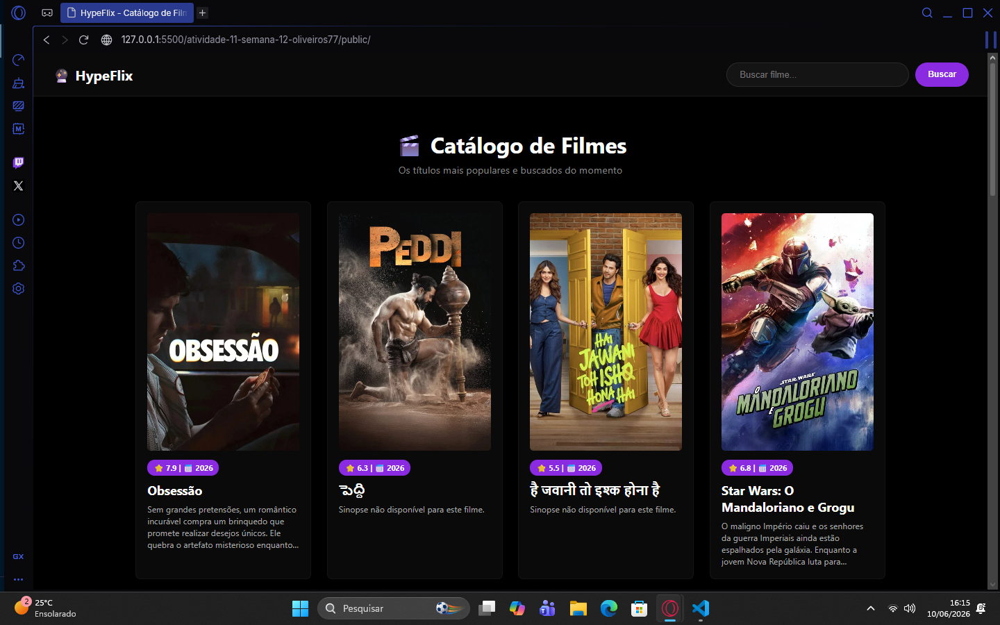
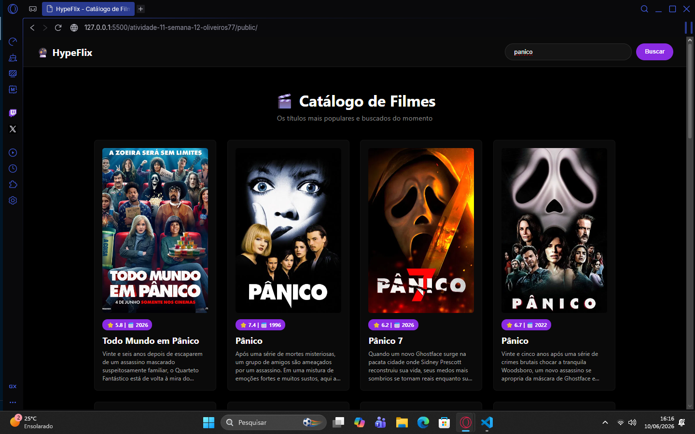

# Trabalho Prático - Semana 12

Nesta atividade, vamos trabalhar com uma API de mercado para montar uma interface de visualização de filmes. Para isso, vamos utilizar a [The Movie Database (TMDB) API](https://developer.themoviedb.org/docs/getting-started). A página resultante deve listar os resultados de uma requisição HTTP em formato de cards e deve incluir uma funcionalidade de pesquisa ou filtro. 

## Informações Gerais

- Nome: Oliveiros
- Matrícula: 1662959

## Prints do trabalho

